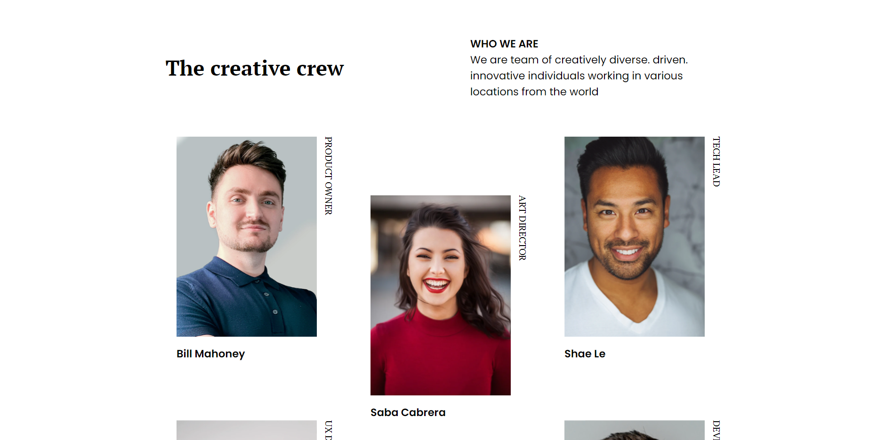
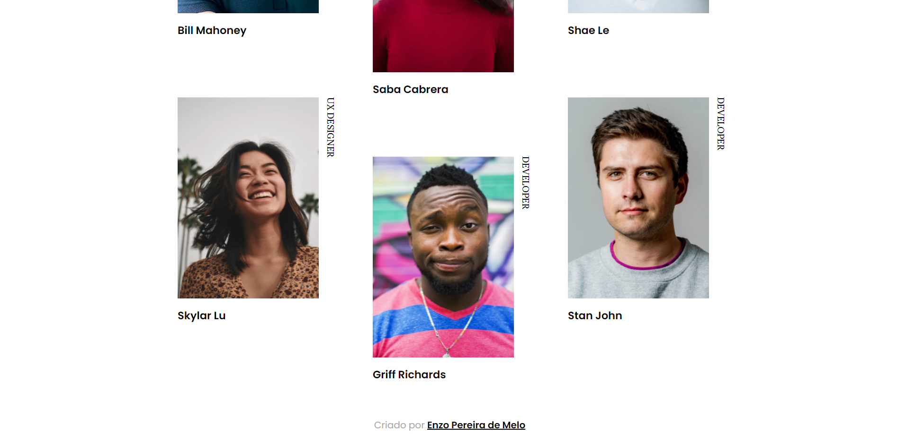
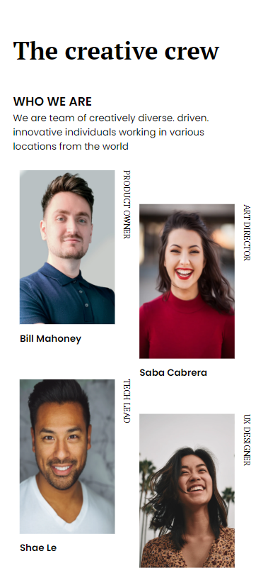
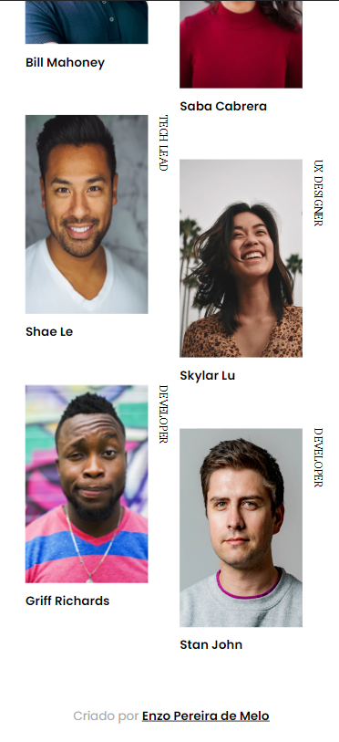

Nesse projeto testo meus conhecimentos de responsividade com HTML e CSS, criando uma página de um time de trabalho, alinhando fotos, papéis e nomes dos membros, disponível para Desktop e Celular

- Link para acessar o site online: 

<!-- Sumário -->

## Sumário

- [Visualização](#vizualização)
  - [Tecnologias](#tecnologias)
- [Contato](#contato)

<!-- First view -->

## Visualização

### Tecnologias

- HTML
- CSS

## Contato

- GitHub [@enzopdm](https://github.com/enzopdm)
- LinkedIn [@EnzoPereira](https://www.linkedin.com/in/enzo-pereira-a5001a221/)